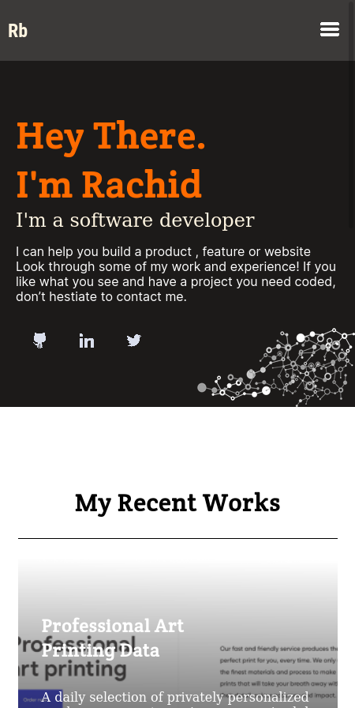
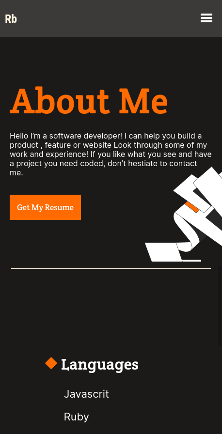

# Portfolio :

> this repo is a Beta version of my portfolio.
## Screenshots
### Mobile

## Built With

- Html & Css
- Visual studio code

## Usage

> Feel Free to use this repo to build your own portfolio.

the template [Template 2](https://www.figma.com/file/l7SqJ3ZfkAKih9sFxvWSR4/Microverse-Student-Project-1?node-id=34%3A1278) i've used is a [Figma](https://www.figma.com) template created by [MICROVERSE](https://www.microverse.org/) a remote school for software developers.

## Getting started
to use this repo locally do the following:

* fork and clone the repository by pasting this command into your command line using SSH `git@github.com:benwmx/Protofolio-Mobile-version.git` or HTTPS `https://github.com/benwmx/Protofolio-Mobile-version.git`
* create a new branch
* make the changes that you want.
* push the code and create a pull request if you don't know how read this article [here](https://docs.github.com/en/github/collaborating-with-pull-requests/proposing-changes-to-your-work-with-pull-requests/creating-a-pull-request)
  

## Live Demo

> This live demo is hosted by --> Github

 ``
  Github pages
 ``
[Rachid-Boudaoudi](https://benwmx.github.io/Protofolio-Mobile-version/)

## Authors

👤 **Rachid Boudaoudi**

- GitHub: [@benwmx](https://github.com/benwmx)
- LinkedIn: [@rachid-boudaoudi](https://www.linkedin.com/in/rachid-boudaoudi-1621a0183/)

## 🤝 Contributing

Contributions, issues, and feature requests are welcome!

Feel free to check the [issues page](../../issues/).

## Show your support

Give a ⭐️ if you like this project!

## 📝 License

This project is [MIT](./MIT.md) licensed.
